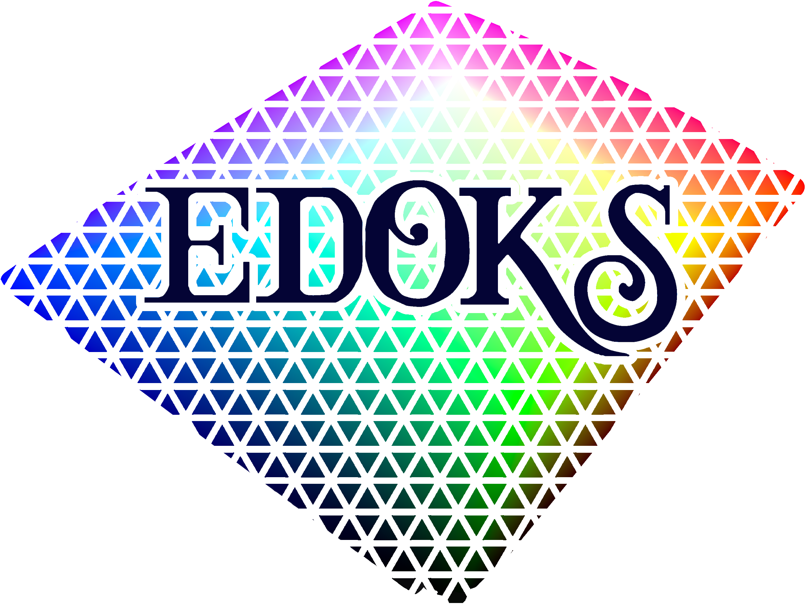

  

  
  
  
  
  
  
  
  

<!-- PROJECT LOGO -->
 

  
  

    Official implementation of the paper <i>EDOKS: A Robust Similarity Index for Perceptual Image Quality Assessment</i>

## About The Project
The code for the Python package will be uploaded soon after the paper is published.
